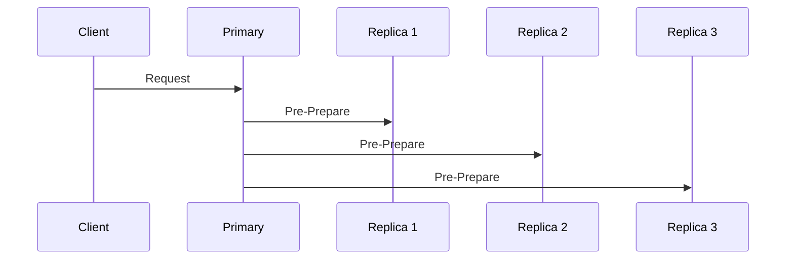

# Accessibility Checklist

Ensuring WCAG 2.1 Level AA compliance for all BFT learning content.

---

## 📋 General Accessibility Requirements

### Content Structure
- [ ] **Semantic HTML**: Use proper heading hierarchy (h1 → h2 → h3, no skipping levels)
- [ ] **Logical reading order**: Content flows logically from top to bottom
- [ ] **Skip to main content**: Include skip link for keyboard users
- [ ] **Page language**: Specify `lang` attribute on HTML elements
- [ ] **Descriptive page titles**: Each page has unique, descriptive `<title>`

---

## 🖼️ Images and Diagrams

### Static Images (SVG, PNG, JPEG)
- [ ] **Alt text**: All images have meaningful `alt` attributes
  - Decorative images: `alt=""`
  - Informative images: Describe content/function
  - Complex diagrams: Provide detailed description
- [ ] **SVG accessibility**:
  - Include `<title>` element (brief description)
  - Include `<desc>` element (detailed description)
  - Use `role="img"` on root `<svg>` element
  - Use `aria-labelledby` to reference title/desc IDs

**Example SVG**:
```xml
<svg role="img" aria-labelledby="diagram-title diagram-desc" xmlns="http://www.w3.org/2000/svg">
  <title id="diagram-title">PBFT Three-Phase Protocol</title>
  <desc id="diagram-desc">
    Sequence diagram showing pre-prepare, prepare, and commit phases between client, 
    primary, and three replica nodes in PBFT consensus
  </desc>
  <!-- SVG content -->
</svg>
```

---

### Mermaid Diagrams
- [ ] **Text alternative**: Provide text description before or after diagram
- [ ] **High contrast**: Use colors meeting WCAG AA contrast ratios (4.5:1 for text)
- [ ] **No color-only encoding**: Don't rely solely on color to convey information
- [ ] **Accessible labels**: Use descriptive labels, avoid abbreviations without explanation

**Example**:
```markdown
The following diagram illustrates PBFT's three-phase message flow:



**Description**: The client sends a request to the primary, which broadcasts pre-prepare 
messages to all replicas (Replica 1, Replica 2, Replica 3).
```

---

### D3.js Interactive Visualizations
- [ ] **Keyboard accessible**: All interactions available via keyboard (Tab, Enter, Arrow keys)
- [ ] **Focus indicators**: Visible focus outline on interactive elements
- [ ] **ARIA roles**: Use `role="img"` or `role="application"` appropriately
- [ ] **ARIA labels**: `aria-label` or `aria-labelledby` for screen readers
- [ ] **Text alternative**: Provide static text description of visualization
- [ ] **State announcements**: Announce state changes to screen readers (`aria-live` regions)

**Example**:
```html
<div id="byzantine-generals-viz" 
     class="interactive-viz" 
     role="application"
     aria-label="Interactive Byzantine Generals scenario simulation"
     tabindex="0">
  <!-- D3 visualization -->
</div>

<p class="sr-only" aria-live="polite" id="viz-status">
  <!-- Dynamic status announcements -->
</p>
```

**Keyboard Controls**:
- Tab: Focus visualization
- Arrow keys: Navigate nodes
- Enter/Space: Toggle node state
- Esc: Reset visualization

---

## 🔗 Links and Navigation

- [ ] **Descriptive link text**: Avoid "click here", use meaningful descriptions
- [ ] **Underlined links**: Links clearly distinguishable (not color-only)
- [ ] **Focus visible**: Links have visible focus indicator
- [ ] **Skip navigation**: Provide "skip to content" link for keyboard users

**Good**: `[Read the HotStuff 2.0 article](https://...)`  
**Bad**: `[Click here](https://...) to read the article`

---

## 🎨 Color and Contrast

- [ ] **Contrast ratios**:
  - Normal text: 4.5:1 minimum
  - Large text (18pt+): 3:1 minimum
  - UI components: 3:1 minimum
- [ ] **Color is not sole indicator**: Use shapes, patterns, or labels in addition to color
- [ ] **High contrast mode**: Test with high contrast mode enabled
- [ ] **Dark mode support**: Ensure adequate contrast in both light and dark themes

**Example (Byzantine vs. Honest nodes)**:
- ❌ Bad: Red for Byzantine, Green for Honest (color-blind users can't distinguish)
- ✅ Good: Red X icon for Byzantine, Green checkmark for Honest (shape + color)

---

## 📝 Forms and Interactive Elements

- [ ] **Labels**: All form inputs have associated `<label>` elements
- [ ] **Instructions**: Clear instructions before form sections
- [ ] **Error messages**: Errors clearly identified and associated with inputs
- [ ] **Required fields**: Use `aria-required` or `required` attribute
- [ ] **Focus order**: Tab order follows logical sequence

---

## 🎬 Multimedia (Videos, Audio)

- [ ] **Captions**: All videos have synchronized captions
- [ ] **Transcripts**: Provide text transcripts for audio/video content
- [ ] **Audio descriptions**: Videos have audio descriptions for visual content
- [ ] **No auto-play**: Media doesn't auto-play with sound

---

## ⌨️ Keyboard Accessibility

- [ ] **All interactive elements keyboard accessible**: No mouse-only interactions
- [ ] **Tab order**: Logical tab order through content
- [ ] **Focus visible**: Visible focus indicator on all focusable elements
- [ ] **Keyboard traps avoided**: Users can navigate away from all elements
- [ ] **Shortcuts documented**: Keyboard shortcuts clearly documented

**Test**: Navigate entire page using only keyboard (Tab, Shift+Tab, Enter, Arrow keys, Esc)

---

## 🔊 Screen Reader Compatibility

- [ ] **ARIA landmarks**: Use `<header>`, `<nav>`, `<main>`, `<aside>`, `<footer>`
- [ ] **ARIA labels**: Interactive elements have accessible names
- [ ] **ARIA live regions**: Dynamic content changes announced
- [ ] **Screen reader only text**: Use `.sr-only` class for additional context
- [ ] **Skip redundant info**: Use `aria-hidden` for decorative elements

**Test with**:
- NVDA (Windows)
- JAWS (Windows)
- VoiceOver (macOS/iOS)
- TalkBack (Android)

---

## 📱 Mobile Accessibility

- [ ] **Touch targets**: Minimum 44x44 CSS pixels
- [ ] **Responsive design**: Content readable at all viewport sizes
- [ ] **Orientation**: Supports portrait and landscape orientations
- [ ] **Zoom**: Content usable at 200% zoom without horizontal scrolling
- [ ] **Gestures**: Complex gestures not required (provide alternatives)

---

## 🖨️ Print Accessibility

- [ ] **Print stylesheet**: Content readable when printed
- [ ] **URL preservation**: Links show URLs in print version
- [ ] **No content hidden**: All content accessible in print format
- [ ] **Page breaks**: Avoid breaking headings, code blocks, diagrams

---

## ✅ Testing Tools

### Automated Testing
- **axe DevTools** (browser extension): [https://www.deque.com/axe/devtools/](https://www.deque.com/axe/devtools/)
- **WAVE** (browser extension): [https://wave.webaim.org/extension/](https://wave.webaim.org/extension/)
- **Lighthouse** (Chrome DevTools): Accessibility audit

### Manual Testing
- **Keyboard navigation**: Tab through entire page
- **Screen reader**: NVDA/JAWS/VoiceOver testing
- **High contrast**: Windows High Contrast Mode
- **Zoom**: Test at 200% zoom
- **Mobile**: Test on real devices (iOS, Android)

---

## 📊 Accessibility Audit Template

### Page: [Page Title]
**Auditor**: [Name]  
**Date**: [YYYY-MM-DD]  
**Tools Used**: [List tools]

| Category | Status | Issues Found | Remediation |
|----------|--------|--------------|-------------|
| Semantic HTML | ✅/❌ | [Description] | [Action items] |
| Images/Diagrams | ✅/❌ | [Description] | [Action items] |
| Color/Contrast | ✅/❌ | [Description] | [Action items] |
| Keyboard Access | ✅/❌ | [Description] | [Action items] |
| Screen Reader | ✅/❌ | [Description] | [Action items] |
| Mobile | ✅/❌ | [Description] | [Action items] |

**Overall**: ✅ PASS / ❌ FAIL

**Critical Issues**: [List any critical issues requiring immediate fix]

**Recommendations**: [Suggested improvements]

---

## 🎯 Module-Specific Considerations

### Module 01 (Foundation)
- [ ] Byzantine Generals visualization: Keyboard accessible, state changes announced
- [ ] Threshold diagrams: Alt text explains 2f+1 and 3f+1 relationships

### Module 02 (PBFT)
- [ ] Sequence diagrams: Describe message flow in text
- [ ] State machine diagrams: Color + shape encoding for states

### Module 03 (HotStuff)
- [ ] Comparison tables: Use `<th>` with scope attributes
- [ ] Mathematical notation: KaTeX renders to accessible MathML

### Module 04 (Practical)
- [ ] External links: Open in new tab with warning (`aria-label`)
- [ ] Code examples: Use `<code>` and `<pre>` with language indication

### Module 05 (Advanced)
- [ ] Research paper links: Indicate PDF format
- [ ] Complex charts: Provide data tables as alternatives

---

## 🚀 Quick Accessibility Checklist (Pre-Publish)

Before publishing any module:

- [ ] Run axe DevTools audit (0 violations for Level AA)
- [ ] Keyboard navigate entire module (no traps, logical order)
- [ ] Test with screen reader (NVDA or VoiceOver)
- [ ] Verify all images have alt text or descriptions
- [ ] Check contrast ratios (use WebAIM Contrast Checker)
- [ ] Test on mobile device (readable, touch targets adequate)
- [ ] Test print view (content intact, URLs visible)
- [ ] Validate HTML (no errors affecting accessibility)

**Sign-off**: _____________________ (Accessibility reviewer)  
**Date**: _____________________

---

## 📚 Resources

- **WCAG 2.1 Guidelines**: [https://www.w3.org/WAI/WCAG21/quickref/](https://www.w3.org/WAI/WCAG21/quickref/)
- **WebAIM Contrast Checker**: [https://webaim.org/resources/contrastchecker/](https://webaim.org/resources/contrastchecker/)
- **ARIA Authoring Practices**: [https://www.w3.org/WAI/ARIA/apg/](https://www.w3.org/WAI/ARIA/apg/)
- **Material for MkDocs Accessibility**: [https://squidfunk.github.io/mkdocs-material/setup/](https://squidfunk.github.io/mkdocs-material/setup/)

---

**Remember**: Accessibility is not optional. All learners deserve equal access to BFT knowledge!
