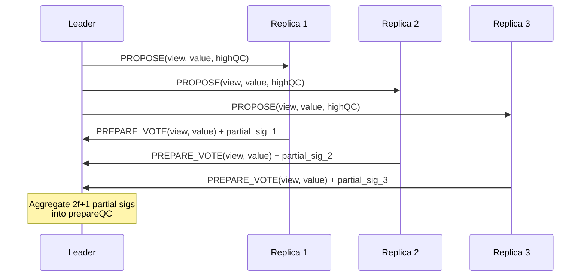
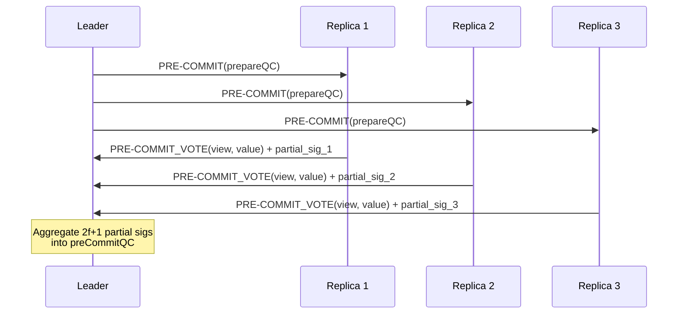

# Two-Phase Protocol with Threshold Signatures

**Goal**: Understand HotStuff's prepare and pre-commit phases, and how threshold signatures enable O(n) communication complexity.

**Prerequisites**: [PBFT three-phase protocol](../02-pbft/three-phase-protocol.md), basic understanding of digital signatures

---

## 🎯 Learning Objectives

- [ ] Explain the prepare phase and what it establishes
- [ ] Explain the pre-commit phase and why it's necessary
- [ ] Describe how threshold signatures work at a high level
- [ ] Calculate message complexity for each phase
- [ ] Compare with PBFT's three phases

---

## 📊 Overview: From Three Phases to Two

### PBFT (Three Phases)
```
Pre-Prepare → Prepare → Commit
(Leader)      (All-to-All) (All-to-All)
O(n)          O(n²)        O(n²)
```

### HotStuff (Two Main Phases)
```
Prepare → Pre-Commit → Commit
(Vote)    (Vote)        (Implicit)
O(n)      O(n)          O(n)
```

**Key Difference**: HotStuff uses threshold signatures to aggregate votes, eliminating all-to-all communication.

---

## 🔐 Threshold Signatures: The Foundation

### What is a Threshold Signature?

A **threshold signature scheme** allows n parties to collectively produce a single signature that requires participation from at least k parties (typically k = 2f+1 in BFT).

**Properties**:
1. **Partial signatures**: Each replica signs with its private key share
2. **Aggregation**: Anyone can combine 2f+1 partial signatures into one valid signature
3. **Verification**: The aggregated signature can be verified against a single public key
4. **Compactness**: The aggregated signature is the same size as an individual signature

### Threshold Signature Setup

**Before consensus starts** (one-time setup):
1. Generate a **threshold key pair** using a distributed key generation (DKG) protocol
2. Each replica i gets a **private key share** sk_i
3. System has a single **public key** pk that verifies threshold signatures

**During consensus**:
1. Replica i signs message m: `partial_sig_i = Sign(sk_i, m)`
2. After collecting 2f+1 partial signatures, leader **aggregates**: `QC = Aggregate({partial_sig_1, ..., partial_sig_{2f+1}})`
3. Anyone can verify: `Verify(pk, m, QC) = true`

### Why This Matters

**PBFT without threshold signatures**:
- Replica broadcasts its vote to all n replicas
- Each replica collects 2f votes from others
- Total: O(n²) messages (n replicas × n broadcasts)

**HotStuff with threshold signatures**:
- Replica sends its partial signature to the leader only
- Leader aggregates 2f+1 partial signatures into 1 QC
- Leader broadcasts 1 QC to all replicas
- Total: O(n) messages (n votes to leader + 1 broadcast from leader)

---

## 📋 Phase 1: Prepare

**Purpose**: Establish that a quorum (2f+1 replicas) has seen and accepted the leader's proposal.

### Prepare Phase Steps



### Detailed Protocol

**Leader (Step 1)**: Broadcast PROPOSE message
```
PROPOSE = {
  view:     current view number
  value:    proposed value/transaction block
  highQC:   highest QC the leader has seen
}
```

**Replica (Step 2)**: Validate and vote
- Check that `view` matches current view
- Verify `highQC` is valid (proper threshold signature)
- Verify `value` is well-formed
- If valid, send PREPARE_VOTE to leader:
  ```
  PREPARE_VOTE = {
    view:      current view number
    value:     hash of proposed value
    signature: Sign(sk_i, (view, value))  // partial signature
  }
  ```

**Leader (Step 3)**: Aggregate votes into prepareQC
- Collect 2f+1 PREPARE_VOTE messages
- Aggregate partial signatures:
  ```
  prepareQC = {
    view:      current view number
    value:     hash of proposed value
    signature: Aggregate(sig_1, sig_2, ..., sig_{2f+1})
  }
  ```

### What Prepare Establishes

After the prepare phase:
- ✅ At least 2f+1 replicas (a quorum) have seen the proposal
- ✅ The leader has proof of this acceptance (prepareQC)
- ✅ prepareQC can be verified by anyone with the public key

**Safety Invariant**: If a prepareQC exists for value v in view k, then at most f replicas can have prepared a different value v' ≠ v in view k.

**Why?** Because 2f+1 replicas prepared v, and there are only 3f+1 total replicas. For a different value v' to get 2f+1 votes, the two quorums must intersect in at least (2f+1) + (2f+1) - (3f+1) = f+1 replicas. Since at most f are Byzantine, at least one honest replica would have to prepare both v and v' in the same view—which honest replicas never do.

---

## 📋 Phase 2: Pre-Commit

**Purpose**: Establish that a quorum knows that a quorum prepared the proposal. This "quorum of quorums" ensures safety across view changes.

### Pre-Commit Phase Steps



### Detailed Protocol

**Leader (Step 1)**: Broadcast PRE-COMMIT message
```
PRE-COMMIT = {
  prepareQC:  the QC from prepare phase
}
```

**Replica (Step 2)**: Verify and vote
- Verify `prepareQC` is a valid threshold signature
- Extract `(view, value)` from prepareQC
- If valid, send PRE-COMMIT_VOTE to leader:
  ```
  PRE-COMMIT_VOTE = {
    view:      view from prepareQC
    value:     hash from prepareQC
    signature: Sign(sk_i, (view, value, "pre-commit"))
  }
  ```

**Leader (Step 3)**: Aggregate votes into preCommitQC
- Collect 2f+1 PRE-COMMIT_VOTE messages
- Aggregate partial signatures:
  ```
  preCommitQC = {
    view:      current view number
    value:     hash of proposed value
    signature: Aggregate(sig_1, sig_2, ..., sig_{2f+1})
  }
  ```

### What Pre-Commit Establishes

After the pre-commit phase:
- ✅ At least 2f+1 replicas have seen the prepareQC
- ✅ These replicas know that a quorum prepared the value
- ✅ The leader has proof of this quorum knowledge (preCommitQC)

**Safety Invariant**: If a preCommitQC exists for value v in view k, then no different value v' ≠ v can be committed in any view ≥ k.

**Why?** Because 2f+1 replicas pre-committed to v, and any future leader (in view k+1 or higher) will receive at least one honest replica's VIEW-CHANGE message containing the preCommitQC for v. The new leader must propose the value from the highest QC, which is v.

---

## 📋 Phase 3: Commit (Implicit in Chained HotStuff)

**Purpose**: Finalize the decision and allow replicas to execute the value.

### Commit Phase Steps

**Leader (Step 1)**: Broadcast COMMIT message
```
COMMIT = {
  preCommitQC:  the QC from pre-commit phase
}
```

**Replica (Step 2)**: Finalize and execute
- Verify `preCommitQC` is valid
- Mark value as **committed**
- Execute the value and update state
- (Optional) Send acknowledgment to leader

**Note**: In **chained HotStuff**, the commit phase is implicit. When a replica sees a prepareQC for block n+1, it knows that block n is pre-committed. When it sees a prepareQC for block n+2, it knows block n is committed.

---

## 📊 Message Complexity Analysis

### Per-Phase Message Count

**With n replicas, f Byzantine faults, and 2f+1 quorum:**

| Phase | Messages to Leader | Broadcasts from Leader | Total Messages |
|-------|-------------------|------------------------|----------------|
| Prepare | n (all replicas vote) | 1 (propose) | n + 1 |
| Prepare Aggregate | 0 (leader aggregates) | 1 (prepareQC) | 1 |
| Pre-Commit | n (all replicas vote) | 1 (pre-commit) | n + 1 |
| Pre-Commit Aggregate | 0 (leader aggregates) | 1 (preCommitQC) | 1 |
| **Total per round** | **2n** | **4** | **~2n + 4 = O(n)** |

### Comparison: PBFT vs. HotStuff

**PBFT (without threshold signatures)**:

| Phase | Message Pattern | Total Messages |
|-------|----------------|----------------|
| Pre-Prepare | Leader → All | n |
| Prepare | All → All | n × n = n² |
| Commit | All → All | n × n = n² |
| **Total** | | **~2n² = O(n²)** |

**HotStuff (with threshold signatures)**:

| Phase | Message Pattern | Total Messages |
|-------|----------------|----------------|
| Prepare | All → Leader, Leader → All | 2n |
| Pre-Commit | All → Leader, Leader → All | 2n |
| **Total** | | **~4n = O(n)** |

### Concrete Example: 100 Replicas

**PBFT**: 2 × 100² = 20,000 messages per consensus round  
**HotStuff**: 4 × 100 = 400 messages per consensus round  
**Reduction**: 50× fewer messages!

---

## 🔄 Why Two Phases? (Not Just One)

### Could We Use Only One Phase?

**Hypothetical One-Phase Protocol**:
1. Leader proposes value
2. Replicas vote, leader aggregates into QC
3. Leader broadcasts QC
4. Replicas commit upon seeing QC

**Problem**: What happens during a view change?

If the leader crashes after some replicas commit but before others receive the QC:
- Some replicas committed value v
- New leader might not know about v
- New leader could propose v' ≠ v
- **Safety violation**: Different replicas commit different values!

### How Two Phases Solve This

**With Prepare + Pre-Commit**:
- Prepare: Value v gets a prepareQC
- Pre-Commit: Value v gets a preCommitQC (proof that a quorum saw prepareQC)
- If leader crashes, at least f+1 honest replicas have the preCommitQC
- New leader receives VIEW-CHANGE from 2f+1 replicas (including at least one honest replica with preCommitQC)
- New leader **must** propose v (the value from the highest QC)
- Safety preserved!

**The "Quorum of Quorums" Pattern**:
- Prepare: "A quorum accepted v"
- Pre-Commit: "A quorum knows that a quorum accepted v"
- This double-quorum ensures any future leader will learn about v

---

## 🧩 Putting It All Together: Full Round Example

**Setup**: n=4 replicas, f=1 Byzantine fault, 2f+1=3 quorum

### Step-by-Step Execution

**1. Leader proposes**
```
Leader → All: PROPOSE(view=1, value="tx_batch_42", highQC=null)
```

**2. Replicas vote (Prepare Phase)**
```
Replica 1 → Leader: PREPARE_VOTE(view=1, hash("tx_batch_42")) + sig_1
Replica 2 → Leader: PREPARE_VOTE(view=1, hash("tx_batch_42")) + sig_2
Replica 3 → Leader: PREPARE_VOTE(view=1, hash("tx_batch_42")) + sig_3
(Replica 4 is Byzantine and stays silent)
```

**3. Leader aggregates and broadcasts prepareQC**
```
prepareQC = Aggregate(sig_1, sig_2, sig_3)
Leader → All: PRE-COMMIT(prepareQC)
```

**4. Replicas vote (Pre-Commit Phase)**
```
Replica 1 → Leader: PRE-COMMIT_VOTE(view=1, hash("tx_batch_42")) + sig_1
Replica 2 → Leader: PRE-COMMIT_VOTE(view=1, hash("tx_batch_42")) + sig_2
Replica 3 → Leader: PRE-COMMIT_VOTE(view=1, hash("tx_batch_42")) + sig_3
```

**5. Leader aggregates and broadcasts preCommitQC**
```
preCommitQC = Aggregate(sig_1, sig_2, sig_3)
Leader → All: COMMIT(preCommitQC)
```

**6. Replicas commit and execute**
```
Replicas 1, 2, 3: Verify preCommitQC → Commit "tx_batch_42" → Execute transactions
```

**Message Count**: 
- Prepare: 4 (1 propose + 3 votes)
- Prepare broadcast: 4 (prepareQC to all)
- Pre-commit: 3 votes
- Pre-commit broadcast: 4 (preCommitQC to all)
- **Total: 15 messages** (vs. 32 messages in PBFT with 4 replicas)

---

## ✅ Key Takeaways

1. **Threshold signatures** enable O(n) complexity by aggregating 2f+1 votes into a single QC
2. **Prepare phase** establishes quorum acceptance of a proposal
3. **Pre-commit phase** establishes that a quorum knows about quorum acceptance (safety across view changes)
4. **Two phases are necessary** to ensure safety when leaders fail between phases
5. **QCs are compact proofs** that can be efficiently propagated and verified

---

## 🔗 Next Steps

- **[Comparison with PBFT](comparison-pbft.md)**: See side-by-side protocol differences
- **[Responsiveness](responsiveness.md)**: Understand how HotStuff eliminates fixed timeouts
- **[Checkpoint](checkpoint.md)**: Test your understanding of the two-phase protocol

---

## 📚 Further Reading

- Original HotStuff paper: [Section 2: The HotStuff Protocol](../../resources/references.md#hotstuff-paper)
- Threshold signatures: [BLS Signatures](../../resources/references.md#bls-signatures)
- Quorum certificates: [Decentralized Thoughts article on QCs](../../resources/references.md#quorum-certificates)
